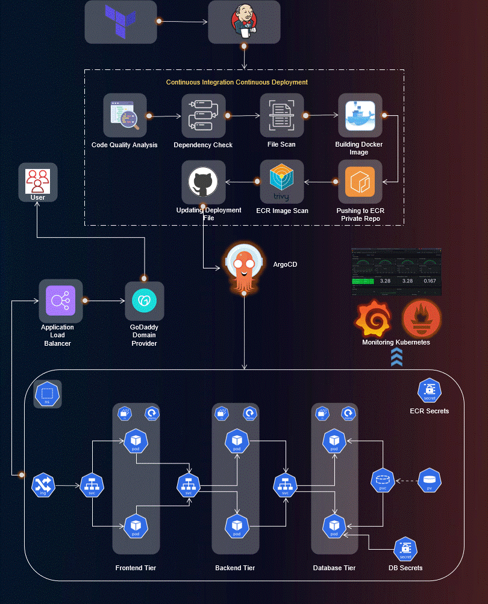

# 🧱 Infrastructure Provisioning: Infra-MERN-Stack-DevOpsified

This documentation outlines the complete infrastructure provisioning steps for setting up a robust DevOps pipeline using Jenkins, Terraform, EKS, and Argo CD. It includes EC2 setup, EKS provisioning, Load Balancer Controller setup, and Argo CD deployment.




---

## 🚀 Step 1: Provision EC2 Instance with DevOps Toolchain

### 🖥️ EC2 Instance Setup

* **OS**: Ubuntu 22.04
* **Instance Type**: t3.medium or higher
* **Storage**: 30 GB minimum
* **Security Group**: Allow ports 22, 8080, 9000, 80/443
* **IAM Role Policies**:

  * `AmazonEC2FullAccess`
  * `AmazonEKSClusterPolicy`
  * `AmazonEKSWorkerNodePolicy`
  * `AmazonECRFullAccess`
  * `AmazonS3FullAccess`
  * `CloudWatchAgentServerPolicy`
  * `IAMFullAccess` *(optional)*

### 👇 User Data Script

Install all DevOps tools on boot (Jenkins, Docker, SonarQube, AWS CLI, kubectl, eksctl, Terraform, Trivy, Helm). \[See full script in original post.]

---

## ⚙️ Step 2: Jenkins Plugins Setup

Install these Jenkins plugins:

* **AWS Credentials**
* **Pipeline: AWS Steps**
* **Terraform**

Set credentials with ID `aws-creds` under Jenkins > Credentials > Global.

Configure Terraform tool under Jenkins > Global Tool Configuration.

---

## 🛠️ Step 4: Provisioning EKS with Jenkins + Terraform

### 📁 Terraform Folder Structure

```
eks/
├── backend.tf
├── dev.tfvars
├── main.tf
├── variables.tf

module/
├── eks.tf
├── vpc.tf
├── iam.tf
├── gather.tf
├── variables.tf
```

### 🔧 Jenkins Pipeline Setup

Create a pipeline named `Infrastructure-Job` with parameters:

* `Environment` (default: dev)
* `Terraform_Action`: plan, apply, destroy

#### Pipeline Stages:

1. **Prepare**
2. **Git Clone**
3. **Terraform Init**
4. **Validate**
5. **Apply/Plan/Destroy**

---

## 🛡️ Step 5: Create & Configure Jump Server

* Launch EC2 in EKS VPC (public subnet)
* AMI: Ubuntu 22.04
* Install AWS CLI, kubectl, eksctl, helm

#### Configure AWS CLI:

```bash
aws configure
```

#### Update kubeconfig:

```bash
aws eks update-kubeconfig --name dev-medium-eks-cluster --region us-east-1
```

#### Validate:

```bash
kubectl get nodes
```

---

## ⚙️ Step 6: Deploy AWS Load Balancer Controller

### Create IAM Policy & Service Account:

```bash
curl -O https://raw.githubusercontent.com/kubernetes-sigs/aws-load-balancer-controller/v2.5.4/docs/install/iam_policy.json
```

Create IAM policy manually or via CLI.

```bash
eksctl create iamserviceaccount \
  --cluster dev-medium-eks-cluster \
  --namespace kube-system \
  --name aws-load-balancer-controller \
  --attach-policy-arn arn:aws:iam::<ACCOUNT_ID>:policy/AWSLoadBalancerControllerIAMPolicy \
  --approve
```

### Helm Install Controller:

```bash
helm repo add eks https://aws.github.io/eks-charts
helm repo update
helm install aws-load-balancer-controller eks/aws-load-balancer-controller \
  -n kube-system \
  --set clusterName=dev-medium-eks-cluster \
  --set serviceAccount.create=false \
  --set serviceAccount.name=aws-load-balancer-controller
```

### Verify:

```bash
kubectl get deployment -n kube-system aws-load-balancer-controller
```

---

## 🚀 Step 7: Deploy Argo CD on Amazon EKS

### 1. Create Namespace:

```bash
kubectl create namespace argocd
```

### 2. Install Argo CD:

```bash
kubectl apply -n argocd -f https://raw.githubusercontent.com/argoproj/argo-cd/v2.4.7/manifests/install.yaml
```

### 3. Verify Components:

```bash
kubectl get all -n argocd
```

### 4. Expose UI via LoadBalancer:

```bash
kubectl edit svc argocd-server -n argocd
```

Change:

```yaml
type: ClusterIP
```

To:

```yaml
type: LoadBalancer
```

> ⚠️ **Note**: When changing the Argo CD server service type to LoadBalancer, the AWS **Cloud Controller Manager** (part of EKS) provisions the ALB — not the AWS Load Balancer Controller we installed.

### 5. Get External IP:

```bash
kubectl get svc -n argocd
```

### 6. Retrieve Admin Password:

```bash
kubectl get secret argocd-initial-admin-secret -n argocd -o yaml
# decode the password
```

### 7. Login to Argo CD:

Go to:

```
http://<EXTERNAL-IP>
```

Credentials:

* Username: `admin`
* Password: `<decoded>`

✅ **Argo CD is now live and accessible!**
